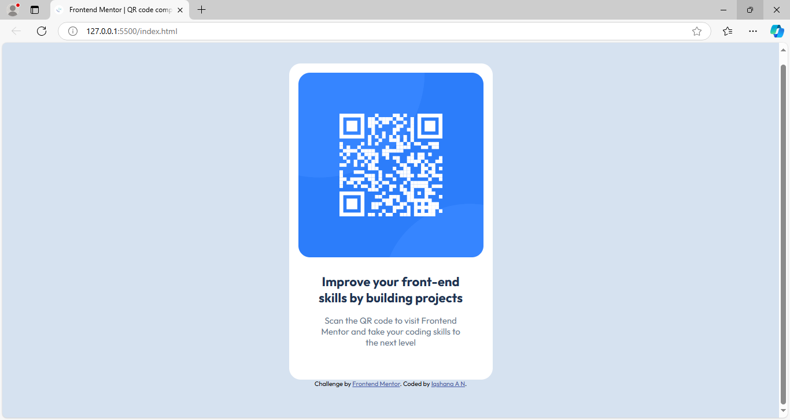

# Frontend Mentor - QR code component solution

This is a solution to the [QR code component challenge on Frontend Mentor](https://www.frontendmentor.io/challenges/qr-code-component-iux_sIO_H). This project helped me practice my front-end development skills, including layout, responsive design, and working with custom CSS properties.

## Table of contents

- [Overview](#overview)
  - [Screenshot](#screenshot)
  - [Links](#links)
- [My process](#my-process)
  - [Built with](#built-with)
  - [What I learned](#what-i-learned)
  - [Continued development](#continued-development)
  - [Useful resources](#useful-resources)


## Overview
This project is a simple QR code component, designed using modern HTML and CSS practices. The component includes a QR code image and a short message, styled with a clean and minimalistic look. The design is responsive and adjusts well to different screen sizes.
### Screenshot



### Links

- Solution URL: [Frontend Mentor Solution](https://your-solution-url.com)
- Live Site URL: [Live Project](https://your-live-site-url.com)

## My process

### Built with

- Semantic HTML5 markup
- CSS custom properties
- Flexbox for layout
- Mobile-first workflow

### What I learned

During this challenge, I gained a better understanding of responsive design and how to efficiently use Flexbox for layout management. I also learned more about structuring clean and maintainable CSS using custom properties.

Here is a code snippet I’m particularly proud of:

```css
body{
    display: flex;
    flex-direction: column;
    align-items: center;
    justify-content: center;
    min-height: 100vh;
    background-color: rgb(214, 226, 240) ;
    font-family: Outfit, sans-serif;
}

```


### Continued development
In future projects, I plan to continue focusing on:

Mastering responsive layouts with Flexbox and Grid
Optimizing CSS for better performance
Enhancing web accessibility and making websites more inclusive


### Useful resources

- [MDN Web Docs - Flexbox](https://developer.mozilla.org/en-US/docs/Web/CSS/CSS_flexible_box_layout/Basic_concepts_of_flexbox) - This helped me for XYZ reason. I really liked this pattern and will use it going forward.
- [CSS Tricks - Flexbox Guide](https://css-tricks.com/snippets/css/a-guide-to-flexbox/) - This is an amazing article which helped me finally understand XYZ. I'd recommend it to anyone still learning this concept.


